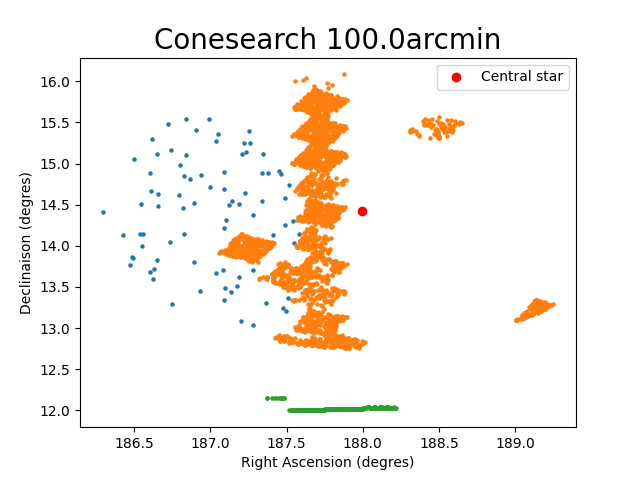

# SED_Simbad_Vizier (M2 Project)

beginabstract
noindent 
The project consist on making a Spectral Energy Distribution (SED) with the data gather inside multiple Vizier's catalogue.newline To be able to do that we have to go through different step, firstly we use a cython to make two function (to_jsky() and search_vega_filter() that we describe later) write in C usable by our code (in python) then we use Simbad to retrieve the Coordinates of a star giving its name (simbad_target_name_resolver()) thanks to this coordinates we make a cone search with Vizier (vizier_cone_search()), in which we take the Flux of every stars, convert there units in jansky (Jsky) (thanks to the function to_jsky() and search_vega_filter()) and lastly create our SED plot (SED()) of the region we selected.
endabstract

## Running the code :
To run the code you need to compile the cython file (cython_code.pyx) thanks to setup.py, and then execute the exe.py without modifying it, all the information needed will be ask as a form of input, in every input if the option are display like a list of numbered answer only the number corresponding to the choice is asked.newline Firstly the prompt will ask the user if he want to run all the questions or to choose a specific question :newline If the user decide to run all the questions he will go through : Simbad target resolver that only uses simbad_target_name_resolver(), then Vizier cone search that uses vizier_cone_search() inside which simbad_target_name_resolver() is used and finally the SED (Using Vizier and Simbad) that uses the SED() inside which vizier_cone_search() is used.
If he want to choose a specific one he will be asked which part of the code he wants to use.newline
Depending on the answer the prompt will ask different information with instructions to follow on how to enter them.
## Function Description :
### Executable :
The executable (exe.py) is design to let the user choose the function he want to use and let him input his choice.
### Definition :
The definition (Def.py) code is where every function is define.
beginitemize
    item search_vega_filter(system, filter_name) : take two strings as arguments, search a matching with the system/filter given inside a table, return three floats, the wavelength and its error in $mu$m and Fmag, the factor needed to convert the flux in Jsky.
    item to_jsky(Fmag, mag) : take two floats as argument, Fmag beeing one of the return of search_vega_filter() and mag, the magnitude you want to convert in Jsky, return the converted magnitude.
    item simbad_target_name_resolver(path, name) : take two strings as argument, the path were you want the final table to be save and the name of the object you want to query (if the name is not specify it will ask you to enter it anyway) return two table, one with the coordinate of the target and an other with the Simbad photometry information.
    item vizier_cone_search(path,filter_SED,catalogue,center_name,radius) : take four strings and one float (radius) as argument, if filter_SED is set to "all" the function will take every filter possible, else you will have to specify each of them. Catalogue, center_name, and radius are the information of your cone search query, if not specify the program will ask you to type them. this function also use the function all_filter() and while_filter() that are function going through all the filter available to convert the magnitude in Jsky. return the table with all the flux and the associate error, the number of filter selected, the list of wavelength and the associate error and finally the radius and the center of the cone search.
    item SED(path, nb_catalogue) : take one string and one integer as argument, the number of catalogues correspond to the number of catalogues that will be used to create the SED. To create the plot the function plot_errorbar() or plot() is called, the function make a scatter plot whith or whithout error bar of the SED. return two plots, the visualisation of the position of stars in the cone search and the SED graphic.
enditemize

## Limit/bug in the code :
### Limitation of the code :
#### vizier_cone_search(path,filter_SED,catalogue,center_name,radius)
Only three catalogues can be used in these code ("III/284/allstars", "II/340/xmmom2_1", "II/262/batc"). It's a strong restriction on the wavelength of the filter.
### Possible bug :
When a list of choice is given (e.g. 0 : Jmag, 1 : Hmag, 2 : Ksmag...) you just have to type the number corresponding to your choice and not the name of it.newline Other mistake (choosing twice the same filter, giving a number of filter that does not exist...) should be handle in the code and giving you again the choice with a remark on the mistake.

#### simbad_target_name_resolver(path, name)
The name given must be the identifier of the object and can't be a coordinate in the sky.
#### vizier_cone_search(path,filter_SED,catalogue,center_name,radius)
the center name is used in the simbad_target_name_resolver() so it also must be an identifier and can't be coordinate even if in Vizier we are able to use coordinate.

## Result :
All your result will be store in the folder result, CAUTION : the previous result will be replace by the new one each time you execute the code.

Three table, the coordinates of the central star the flux given by simbad and the flux given by vizier, are also download in the result folder as .ecsv so you can use the value as you like later.
